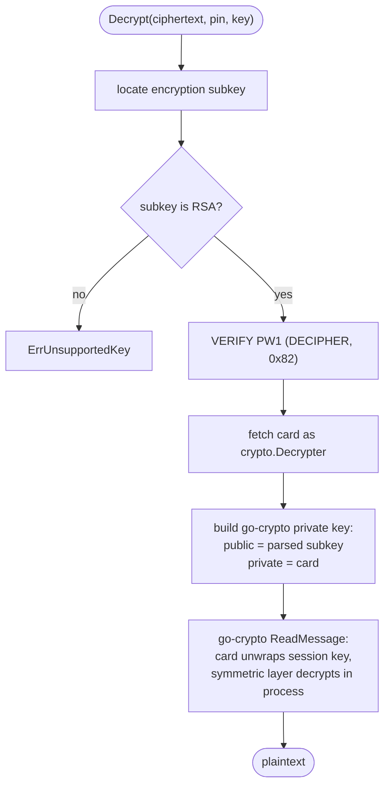

# Decryption

`Decrypt` recovers the plaintext of a raw OpenPGP message, asking the card to
unwrap the session key. For RFC 3156 `multipart/encrypted` email, use
[`DecryptMIME`](#decryptmime) instead.

```go
func (c *Card) Decrypt(ciphertext []byte, pin string, key *openpgp.Entity) ([]byte, error)
```

- `ciphertext` — the raw OpenPGP message (binary, not the MIME envelope).
- `pin` — the user PIN (PW1), used here in DECIPHER mode.
- `key` — the recipient's **public** key, whose encryption subkey identifies
  the session key to unwrap. Load it with `LoadEntity` or `ParseEntity`.

## RSA only

This is the deliberate limitation worth stating up front:

> [!IMPORTANT]
> Only **RSA** decryption keys are supported. An ECDH / Curve25519 key returns
> `ErrUnsupportedKey`.

The reason is structural. `go-crypto` decrypts an RSA session key by calling
`crypto.Decrypter` on whatever you supply as the private key — and the card
*is* a `crypto.Decrypter`. So the card slots in cleanly. For ECDH, `go-crypto`
reaches for the private scalar to run the key-agreement in process, and the
card never releases that scalar. Bridging it would mean reimplementing the
RFC 6637 KDF and AES key-unwrap around the card's raw `ECDH` operation. Until
that lands, reach for `gpg-agent` for Curve25519 decryption.

## How it works



1. The recipient's encryption subkey is located in `key` (the first subkey
   whose self-signature carries an encrypt flag).
2. Its algorithm is checked — non-RSA stops here with `ErrUnsupportedKey`.
3. The PIN is verified in DECIPHER mode (PW1, reference `0x82`).
4. The card's decryption key is fetched as a `crypto.Decrypter`.
5. A `go-crypto` private key is built whose **public half comes from the parsed
   subkey** (so the key ID matches the message's PKESK) and whose **private
   half is the card**. `go-crypto` then routes the session-key unwrap to the
   card and decrypts the symmetric layer in process.

Because the symmetric decryption runs through `go-crypto`'s
`ReadMessage`, you get its handling of compression, the MDC integrity check,
and SEIPD packets for free.

## Errors

| Error | Meaning |
|-------|---------|
| `ErrNoKey` | No encryption subkey in `key`, or no decryption key on the card. |
| `ErrUnsupportedKey` | The encryption subkey is not RSA. |
| `ErrPIN` | PIN verification failed (check the retry counter). |
| `ErrDecrypt` | The card unwrapped a key but the message didn't decrypt — wrong recipient key, corrupt ciphertext, or an unsupported packet. |

```go
plain, err := card.Decrypt(ciphertext, pin, key)
if errors.Is(err, cardhl.ErrUnsupportedKey) {
    log.Fatal("this card's decryption key is ECDH; use gpg-agent")
}
```

## DecryptMIME

For RFC 3156 `multipart/encrypted` messages, use `DecryptMIME`. It parses the
MIME structure, extracts and decodes the armor, and calls `Decrypt` — so you
pass in a full MIME message and get back the plaintext.

```go
func (c *Card) DecryptMIME(payload []byte, pin string, key *openpgp.Entity) ([]byte, error)
```

- `payload` — a complete `multipart/encrypted` MIME message (headers + body).
- `pin` / `key` — same as `Decrypt`.

```go
key, err := cardhl.LoadEntity("recipient.asc")
if err != nil {
    log.Fatal(err)
}
plain, err := card.DecryptMIME(encryptedMessage, pin, key)
if err != nil {
    log.Fatal(err)
}
```

`DecryptMIME` wraps `ErrDecrypt` around any MIME-parsing failure, and the
`ErrMIME` sentinel is available if you need to distinguish a malformed envelope
from a failed card operation:

```go
if errors.Is(err, cardhl.ErrMIME) {
    // the message structure was invalid, not a card error
}
```

See [PGP/MIME](./mime) for the full picture of how the MIME layer works.
