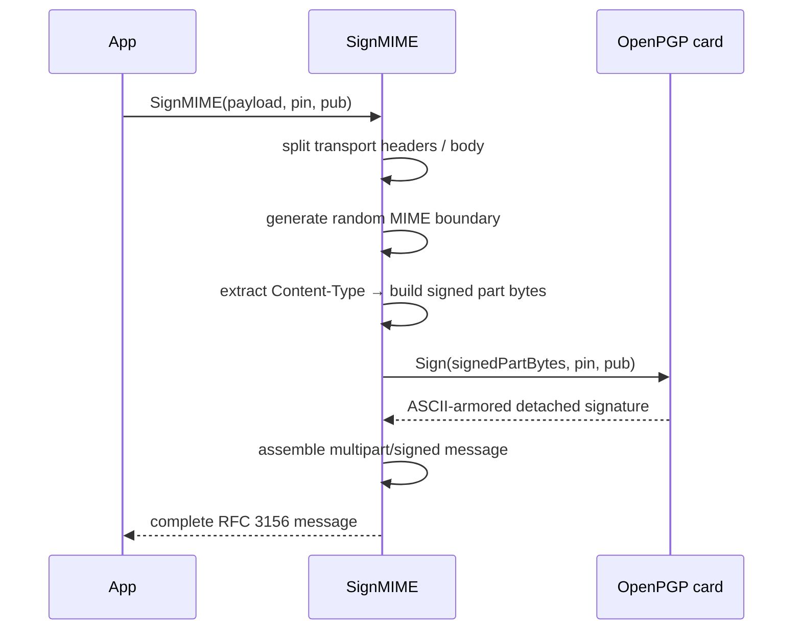
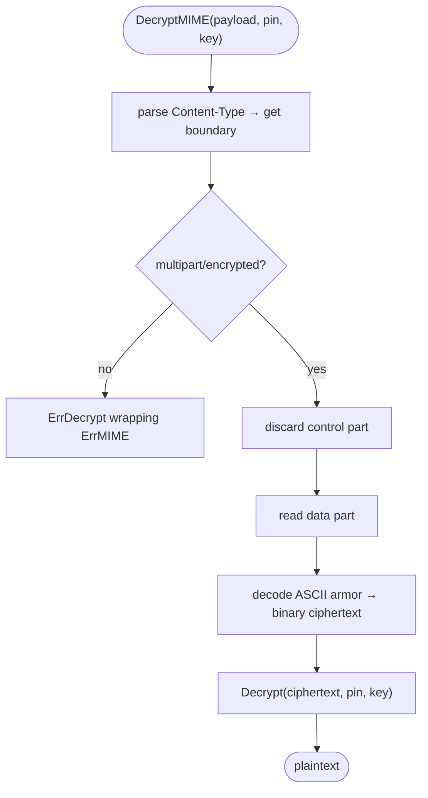

# PGP/MIME

RFC 3156 defines how OpenPGP signatures and encryption are carried inside
MIME email messages. This library implements both sides:

- `SignMIME` — wraps any MIME message in a `multipart/signed` envelope.
- `DecryptMIME` — unwraps a `multipart/encrypted` envelope and returns the
  plaintext.

Both methods handle boundary generation, MIME part structure, and ASCII armor
internally, so the caller only needs to provide the raw MIME message and a PIN.

## Signing — `SignMIME`

```go
func (c *Card) SignMIME(payload []byte, pin string, pub *packet.PublicKey) ([]byte, error)
```

- `payload` — a raw MIME message: transport headers (`From`, `To`, `Subject`,
  etc.) followed by `\r\n\r\n` and the body with its own content headers.
- `pin` — the user PIN (PW1), authorizes the signing operation.
- `pub` — the signing-capable public key, obtained with `LoadPublicKey` or
  `ParsePublicKey`.

### What comes back

A complete `multipart/signed` message conforming to RFC 3156 §3:

```
From: you@example.com
To: them@example.com
Subject: Hello
MIME-Version: 1.0
Content-Type: multipart/signed;
    boundary="----=_Part_…";
    micalg=pgp-sha256;
    protocol="application/pgp-signature"

------=_Part_…
Content-Type: text/plain

Hello, world.
------=_Part_…
Content-Type: application/pgp-signature; name="signature.asc"
Content-Description: OpenPGP digital signature
Content-Disposition: attachment; filename="signature.asc"

-----BEGIN PGP SIGNATURE-----
…
-----END PGP SIGNATURE-----
------=_Part_…--
```

### How it works



1. Transport headers (`From`, `To`, `Subject`, …) are separated from content
   headers (`Content-Type`, `MIME-Version`, …) at the `\r\n\r\n` boundary.
2. A random 16-byte boundary string is generated.
3. The signed part is assembled from the original `Content-Type` header and
   body — this is the exact byte sequence the signature covers.
4. `Sign` is called with that byte sequence; the card produces a detached
   signature.
5. The final message is assembled: transport headers at the top level, the
   new `multipart/signed` `Content-Type`, and the two parts.

### Example

```go
pub, err := cardhl.LoadPublicKey("key.asc")
if err != nil {
    log.Fatal(err)
}

card, err := cardhl.Open()
if err != nil {
    log.Fatal(err)
}
defer card.Close()

rawMessage := []byte(
    "From: you@example.com\r\n" +
    "To: them@example.com\r\n" +
    "Subject: Signed mail\r\n" +
    "Content-Type: text/plain\r\n" +
    "MIME-Version: 1.0\r\n" +
    "\r\n" +
    "This message is signed.\r\n",
)

signed, err := card.SignMIME(rawMessage, pin, pub)
if err != nil {
    log.Fatal(err)
}
// signed is ready to hand to an SMTP client.
```

## Decryption — `DecryptMIME`

```go
func (c *Card) DecryptMIME(payload []byte, pin string, key *openpgp.Entity) ([]byte, error)
```

- `payload` — a complete `multipart/encrypted` MIME message.
- `pin` — the user PIN (PW1), authorizes the decryption operation.
- `key` — the recipient's **public** key entity. Load it with `LoadEntity` or
  `ParseEntity`.

> [!IMPORTANT]
> `DecryptMIME` supports **RSA** decryption keys only, for the same reason as
> `Decrypt`: ECDH requires the private scalar, which the card never releases.
> An ECDH key returns `ErrUnsupportedKey`.

### How it works



1. The `Content-Type` header is located and parsed; anything other than
   `multipart/encrypted` with `protocol="application/pgp-encrypted"` returns
   `ErrDecrypt` wrapping `ErrMIME`.
2. The first MIME part (the RFC 3156 control part, `Version: 1`) is discarded.
3. The second part (`application/octet-stream`) is read and its ASCII armor
   is decoded to binary.
4. `Decrypt` is called with the binary ciphertext.

### Example

```go
key, err := cardhl.LoadEntity("recipient.asc")
if err != nil {
    log.Fatal(err)
}

card, err := cardhl.Open()
if err != nil {
    log.Fatal(err)
}
defer card.Close()

plain, err := card.DecryptMIME(encryptedMessage, pin, key)
switch {
case errors.Is(err, cardhl.ErrMIME):
    log.Fatal("malformed multipart/encrypted envelope")
case errors.Is(err, cardhl.ErrUnsupportedKey):
    log.Fatal("ECDH key — use gpg-agent instead")
case err != nil:
    log.Fatal(err)
}
```

## Errors specific to MIME operations

| Error | Meaning |
|-------|---------|
| `ErrMIME` | The MIME envelope was malformed: missing `\r\n\r\n` separator, wrong `Content-Type`, missing boundary parameter, missing or unreadable MIME parts, or invalid PGP armor. |
| `ErrDecrypt` | Wraps `ErrMIME` when the envelope cannot be parsed; also wraps lower-level decryption errors from the card. Use `errors.Is` to distinguish. |

```go
if errors.Is(err, cardhl.ErrMIME) {
    // envelope problem — log and reject the message
} else if errors.Is(err, cardhl.ErrDecrypt) {
    // card-level failure — check PIN, key match, or card presence
}
```
