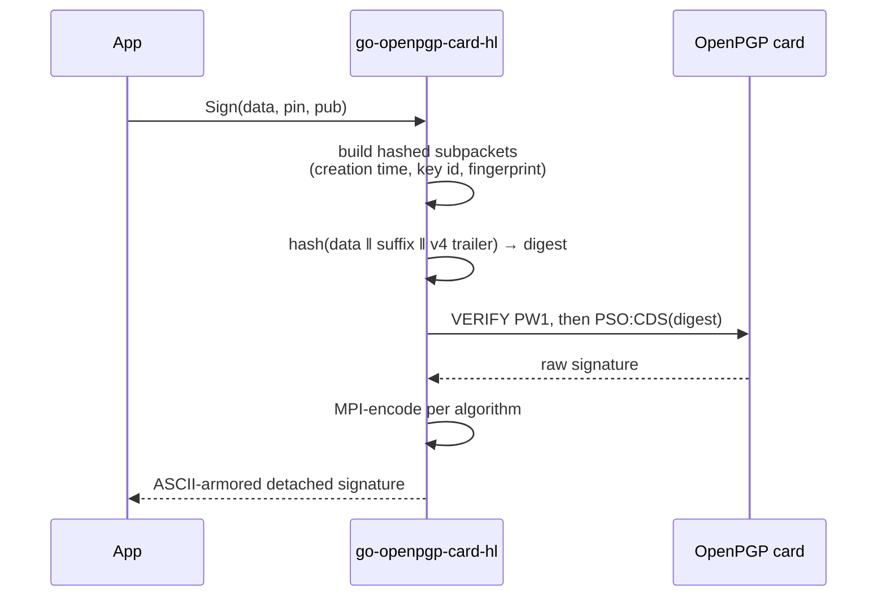

# Signing

`Sign` produces a **detached, ASCII-armored OpenPGP signature** over the bytes
you give it, with the heavy lifting done on the card.

```go
func (c *Card) Sign(data []byte, pin string, pub *packet.PublicKey) ([]byte, error)
```

- `data` — the bytes to sign, covered verbatim as a binary document
  (signature type `0x00`).
- `pin` — the user PIN (PW1). Authorizes this one operation.
- `pub` — the signing key's public half, for the signature-packet metadata.

## How the packet is built

The card can sign a digest, but it can't build an OpenPGP signature packet —
that's this library's job.



The steps, all in `buildSignaturePacket`:

1. **Hashed subpackets** are assembled: signature creation time (type 2),
   issuer key ID (type 16), and issuer fingerprint (type 33). These bind the
   signature to *when* and *by which key* it was made, and are covered by the
   hash.
2. **The hash suffix** is laid out per RFC 4880 §5.2.4: version `0x04`,
   signature type `0x00`, the public-key algorithm, the hash algorithm
   (SHA-256), then the two-octet length of the hashed subpackets followed by
   the subpackets themselves.
3. **The hash** is computed over `data || hash-suffix || v4-trailer`, where the
   trailer is `0x04 0xFF` plus the 4-byte big-endian length of the suffix.
4. **The card signs** the resulting digest via its `crypto.Signer`.
5. **The raw signature is MPI-encoded** for the key's algorithm.
6. The body is wrapped in a **new-format packet** (tag 2) and **ASCII-armored**.

## Per-algorithm signature encoding

The card returns a raw signature; OpenPGP wants algorithm-specific MPIs.

| Algorithm | Card output | Packet encoding |
|-----------|-------------|-----------------|
| **EdDSA** (Ed25519) | 64 bytes: `r ‖ s` | two MPIs, `r` then `s` (32 bytes each) |
| **ECDSA** (NIST P-curves) | ASN.1 DER `SEQUENCE { INTEGER r, INTEGER s }` | parsed to `r`, `s`, then two MPIs |
| **RSA** | one big-endian integer | a single MPI |

The ECDSA DER parser (`parseASN1Signature`) bounds-checks every field length
against the buffer: a truncated or malformed signature yields a typed error,
never an out-of-range panic.

> [!NOTE]
> An MPI is `[2-byte bit length][big-endian bytes]`, with leading zero bytes
> stripped before the bit count is computed. `writeMPI` handles the edge cases —
> an all-zero value collapses to a single zero byte with a bit length of 0.

## Choosing what to sign

Because the signature covers `data` verbatim, **you** decide what bytes are
covered. That keeps the library out of your framing:

- **git commit/tag signing** — git hands the object to the signing program on
  stdin and expects the armored signature on stdout. Pass that object to
  `Sign`.
- **`multipart/signed` mail (PGP/MIME)** — canonicalize the MIME part you want
  to protect (CRLF line endings, the right `Content-Type`), pass it to `Sign`,
  and place the armored result in the `application/pgp-signature` part.
- **Plain detached signatures** — pass the file contents; ship the `.asc`
  alongside.

> [!CAUTION]
> The hash algorithm is SHA-256 and the signature type is binary (`0x00`). If
> you need a *text* signature (type `0x01`, with CRLF canonicalization) or a
> different digest, that is not currently exposed — open an issue describing the
> use case.
